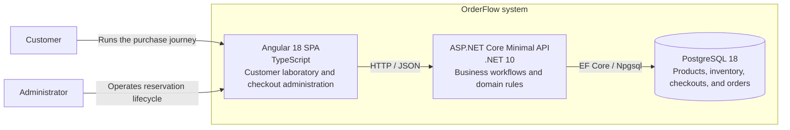
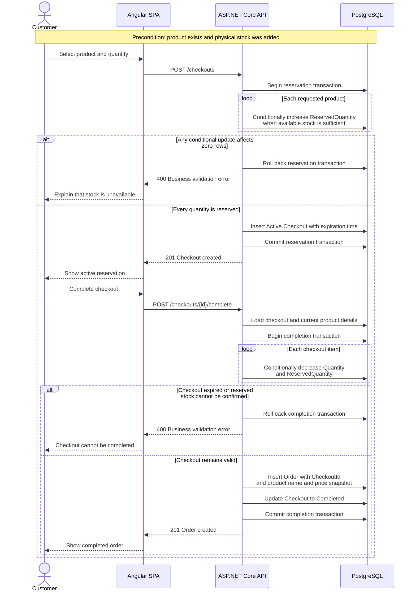

# OrderFlow

OrderFlow is a software engineering laboratory that evolves from demonstrated
problems instead of anticipated complexity.

## Architecture Discovery

### Natural-language description

OrderFlow is a learning-oriented order and stock-reservation system. A customer
uses an Angular web application to create products for the laboratory, add
stock, reserve product quantities by starting a checkout, and complete that
checkout as an order. An administrative view lists checkout states and allows
overdue reservations to be explicitly expired so their stock is released.

The current architecture is a modular monolith. One ASP.NET Core Minimal API
contains the logical Products, Inventory, Checkouts, and Orders boundaries and
coordinates them through one EF Core DbContext and database transaction when a
workflow crosses boundaries. PostgreSQL is the durable Development store.
SQLite in-memory is a deliberate test substitution, not a production container.

There are currently no external business integrations. Payment, messaging,
automatic expiration, authentication, and authorization are outside the
implemented scope.

### Discovery frame

| Concern | Current decision |
| --- | --- |
| Scope | The implemented purchase, reservation, cancellation, manual expiration, order-query, and operational-health flows. |
| Structural view | C4-inspired container level. Source-code modules, classes, and endpoints are intentionally omitted. |
| System boundary | The Angular SPA, ASP.NET Core API, and PostgreSQL database belong to OrderFlow. |
| Responsibilities | Angular provides customer and administrative interactions; the API enforces workflows and domain rules; PostgreSQL persists products, inventory, checkouts, and orders. |
| Integrations | Angular calls the API synchronously over HTTP/JSON; the API accesses PostgreSQL through EF Core and Npgsql. No external business system is integrated. |
| Constraints | Keep one deployable backend and one DbContext until a demonstrated problem justifies separation. Never allow reserved stock to exceed physical stock. Complete checkout, consume reserved stock, and create the order atomically. |
| Known gaps | Identity, roles, payments, automatic reservation expiration, production deployment, observability, performance targets, and asynchronous communication remain undecided or unimplemented. |

### Structural diagram - C4-inspired container view

This diagram shows runtime containers only. Products, Inventory, Checkouts, and
Orders are logical boundaries inside the API, not independently deployable
containers.



### Behavioral diagram - reserve and complete checkout

The critical journey starts with an existing product and available physical
stock. The sequence makes both transactional boundaries and realistic business
failures explicit.



### GenAI review and human adjustments

The model correctly inferred that the browser-facing SPA, backend API, and
relational database are the relevant runtime containers. It also identified the
reservation and completion transactions, the synchronous HTTP boundary, and the
need to show failure paths rather than only the happy path.

The generated view required deliberate corrections. Products, Inventory,
Checkouts, and Orders remain logical modules inside one API instead of becoming
microservices. Payment, queues, a cart, automatic expiration, and external
providers were excluded because the code does not implement them. SQLite was
also excluded from the runtime view because it is a test substitution. The
sequence was aligned with the implementation so product name and price are read
at completion and preserved in the final Order.

For an agent to extend OrderFlow without inventing decisions, the documentation
would still need explicit identity and RBAC policies, payment semantics, an
automatic-expiration ownership model, production topology and migration policy,
API compatibility rules, observability requirements, expected workload and
service-level objectives, and delivery guarantees for any future messaging.
Those are recorded as gaps rather than silently filled with assumptions.

## Prerequisites

- .NET 10 SDK
- Node.js 24
- Docker Desktop

## Run Locally

Start the persistent PostgreSQL database:

```powershell
docker compose up -d postgres
```

Start the API in one terminal. The API applies pending migrations in the
Development environment and listens on `http://localhost:5216`.

```powershell
dotnet run --project src/OrderFlow.Api/OrderFlow.Api.csproj
```

Start Angular in another terminal and open `http://localhost:4200`:

```powershell
cd src/OrderFlow.Web
npm install
npm start
```

The PostgreSQL volume survives API and container restarts. Stop the environment
without deleting its data:

```powershell
docker compose down
```

Explicitly remove the local database and start from an empty volume:

```powershell
docker compose down -v
```

The credentials committed in `appsettings.Development.json` and `compose.yaml`
are local-development defaults. Production credentials must come from a secret
store or environment variables.

## Health Checks

With the API running, inspect its two operational signals:

```powershell
Invoke-WebRequest http://localhost:5216/health/live
Invoke-WebRequest http://localhost:5216/health/ready
```

`/health/live` returns success when the application process can answer HTTP. It
does not contact external dependencies. `/health/ready` returns success only
when the application can also connect to its configured database. A running API
therefore remains alive but becomes unready if PostgreSQL is unavailable.

## Tests

Backend tests use isolated SQLite in-memory databases and do not require Docker:

```powershell
dotnet test OrderFlow.slnx
```

With PostgreSQL running, explicitly include the slower provider-specific
concurrency tests:

```powershell
$env:ORDERFLOW_RUN_POSTGRESQL_TESTS = "true"
dotnet test OrderFlow.slnx
Remove-Item Env:ORDERFLOW_RUN_POSTGRESQL_TESTS
```

These tests create and truncate a separate `orderflow_tests` database. They do
not clean or modify the `orderflow` Development database.

Frontend behavioral and browser tests also remain self-contained:

```powershell
cd src/OrderFlow.Web
npm test -- --watch=false --browsers=ChromeHeadless
npm run test:e2e
```

## Documentation

- [Current state](docs/CURRENT_STATE.MD)
- [System flow report](docs/reports/SYSTEM_FLOW.md)
- [Engineering experiments](docs/experiments)
- [Learning journal](docs/journal)
