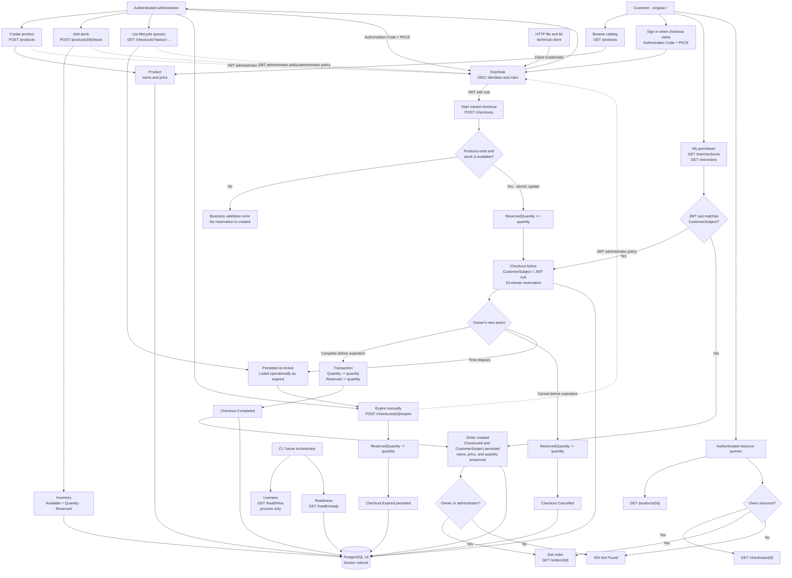
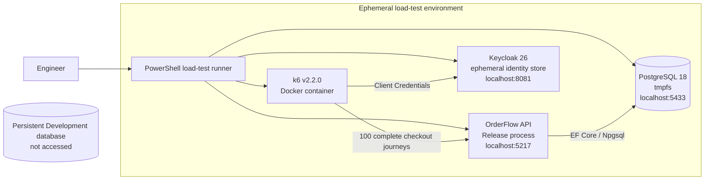

# System Flow Report

This living report records how OrderFlow capabilities and architecture connect
at meaningful points in the laboratory's evolution. Update the diagram when a
new business flow, infrastructure boundary, or architectural component changes
how the system behaves. Git history preserves each previous snapshot.

## Current Snapshot

| Field | Value |
| --- | --- |
| Recorded at | 2026-09-12 |
| Project stage | V1 - Initial implementation |
| Baseline commit | `6d2bc88` |
| Persistence | EF Core with PostgreSQL 18 for Development and SQLite in-memory for tests |
| User interfaces | Angular storefront, customer account, product administration, and checkout administration |
| Identity | Keycloak 26.7.3 with a versioned Development realm and PostgreSQL store |
| Automation | GitHub Actions quality gates and a manual isolated k6 load baseline |

## Flow Diagram

## Load-Test Boundary

The performance harness is isolated from the persistent Development environment.
The runner owns every temporary resource and removes it after each execution.

## Behavior Notes

- `Quantity` represents physical stock.
- `ReservedQuantity` represents stock committed to active checkouts.
- Starting a checkout changes only `ReservedQuantity`.
- Cancellation and expiration release `ReservedQuantity` without reducing
  physical stock.
- Completion atomically reduces both quantities, completes the checkout, and
  creates the order.
- An overdue checkout is recognized as expired during reads, but inventory is
  released only after the administrator persists the `Expired` transition.
- Order items preserve the product name and price read at completion time.
- Every new order preserves the checkout that originated it; legacy orders may
  have no `CheckoutId` because the relationship was introduced later.
- Every new checkout captures the authenticated OIDC `sub`, and its resulting
  order preserves that same customer subject.
- Customers can read, cancel, and complete only their own resources. A different
  customer receives `404`; administrators may read any resource but cannot
  complete another customer's purchase.
- Customer history is queried through `/me/checkouts` and `/me/orders`. The API
  derives the subject from the token and never accepts a customer identifier from
  the browser for these queries.
- Legacy ownerless purchases remain visible to administrators but cannot be
  claimed or completed by a customer.

## Architectural Boundaries

- Angular provides a public customer storefront, an authenticated self-service
  account area, and authenticated product and checkout administration inside one
  SPA.
- Keycloak authenticates Development users and issues JWT access tokens through
  Authorization Code with PKCE; its data is isolated in a dedicated PostgreSQL
  database.
- The API validates issuer, audience, signature, lifetime, and the
  `administrator` role for product creation, stock addition, checkout listing,
  and manual expiration.
- Authenticated customer commands use the OIDC `sub` as the stable ownership
  key. Indexed nullable database columns preserve legacy rows, while new domain
  objects require ownership.
- Angular route guards improve navigation but are not the authorization
  boundary; server-side policies protect administrative data and commands.
- ASP.NET Core exposes feature-oriented Minimal API endpoints.
- Products, Inventory, Checkouts, and Orders are logical modules in one process.
- One EF Core DbContext and database transaction coordinate cross-module writes.
- PostgreSQL runs in Docker and stores Development data in a named volume.
- EF Core migrations evolve the PostgreSQL schema and are applied at local
  Development startup.
- A foreign key protects the Order-to-Checkout reference, and a filtered unique
  index enforces the one-checkout-to-at-most-one-order invariant while retaining
  compatibility with legacy orders.
- SQLite in-memory remains a deliberate substitution for isolated integration
  and browser tests.
- Unit, integration, Angular behavioral, and browser E2E tests protect the flow.
- Opt-in PostgreSQL tests validate atomic reservation and idempotent completion
  under concurrent requests against the real provider.
- Liveness reports whether the process answers HTTP without consulting external
  dependencies; readiness additionally verifies database connectivity.
- The manual k6 harness obtains a machine token through Client Credentials,
  measures a Release API against ephemeral PostgreSQL and Keycloak, and
  validates stock and Order invariants after every generated journey.

## Known Missing Flows

- Automatic reservation expiration
- Payment processing
- Product maintenance beyond creation
- Cart management
- Durable production persistence
- Asynchronous messaging and external integrations

## Revision History

| Date | Stage | Change |
| --- | --- | --- |
| 2026-09-06 | V1 baseline | Recorded the complete purchase, cancellation, and manual expiration flows. |
| 2026-09-06 | Persistent Development | Added PostgreSQL, Docker volume, and EF Core migrations without changing business flows. |
| 2026-09-06 | PostgreSQL concurrency | Verified reservation limits and single-order completion without changing business flows. |
| 2026-09-07 | Schema evolution | Linked new orders to their originating checkout and validated forward and rollback migrations. |
| 2026-09-07 | Operational health | Added separate process liveness and database readiness signals. |
| 2026-09-10 | Load baseline | Measured 100 isolated checkout journeys while preserving business invariants. |
| 2026-09-10 | Authentication boundary | Added Keycloak OIDC and protected checkout administration by role. |
| 2026-09-10 | Storefront boundary | Added a public catalog, protected product operations, and separated customer and administrator UI flows. |
| 2026-09-11 | Customer ownership | Persisted OIDC subjects on purchases and enforced owner-scoped customer operations. |
| 2026-09-12 | Customer account | Added token-derived self-service history and recovery of active purchases. |
