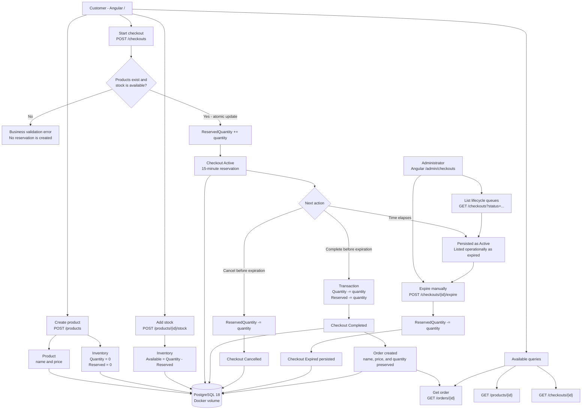

# System Flow Report

This living report records how OrderFlow capabilities and architecture connect
at meaningful points in the laboratory's evolution. Update the diagram when a
new business flow, infrastructure boundary, or architectural component changes
how the system behaves. Git history preserves each previous snapshot.

## Current Snapshot

| Field | Value |
| --- | --- |
| Recorded at | 2026-09-06 |
| Project stage | V1 - Initial implementation |
| Baseline commit | `27ea7be` |
| Persistence | EF Core with PostgreSQL 18 for Development and SQLite in-memory for tests |
| User interfaces | Angular purchase laboratory and checkout administration |
| Automation | Backend, frontend, and Playwright E2E jobs in GitHub Actions |

## Flow Diagram

## Behavior Notes

- `Quantity` represents physical stock.
- `ReservedQuantity` represents stock committed to active checkouts.
- Starting a checkout changes only `ReservedQuantity`.
- Cancellation and expiration release `ReservedQuantity` without reducing
  physical stock.
- Completion atomically reduces both quantities, completes the checkout, and
  creates the order.
- An overdue checkout is recognized as expired during reads, but inventory is
  released only after the administrator persists the `Expired` transition.
- Order items preserve the product name and price read at completion time.

## Architectural Boundaries

- Angular provides the customer laboratory and administrative operations.
- ASP.NET Core exposes feature-oriented Minimal API endpoints.
- Products, Inventory, Checkouts, and Orders are logical modules in one process.
- One EF Core DbContext and database transaction coordinate cross-module writes.
- PostgreSQL runs in Docker and stores Development data in a named volume.
- EF Core migrations evolve the PostgreSQL schema and are applied at local
  Development startup.
- SQLite in-memory remains a deliberate substitution for isolated integration
  and browser tests.
- Unit, integration, Angular behavioral, and browser E2E tests protect the flow.

## Known Missing Flows

- Authentication and authorization
- Automatic reservation expiration
- Payment processing
- Product maintenance beyond creation
- Cart management
- Durable production persistence
- Asynchronous messaging and external integrations

## Revision History

| Date | Stage | Change |
| --- | --- | --- |
| 2026-09-06 | V1 baseline | Recorded the complete purchase, cancellation, and manual expiration flows. |
| 2026-09-06 | Persistent Development | Added PostgreSQL, Docker volume, and EF Core migrations without changing business flows. |
